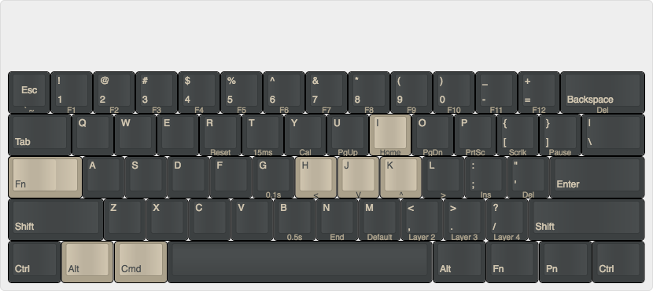

Pok3r keyboard layout
=====================

This documents a Mac layout for the programmable Pok3r keyboard.

General programming guide: [link](https://www.reddit.com/r/MechanicalKeyboards/comments/35uy60/guide_howto_program_your_pok3r_programming_layers/)

These are applied on layer 3 (fn+.)

Swap win (cmd) and left-alt

hjkl Vim-style movement; i mapped to home:
fn+h -> fn+j (left)
fn+j -> fn+k (down)
fn+k -> fn+i (up)
fn+i -> fn+h (home)

